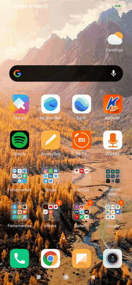

<h1 align="center">
    
</h1>

<h1 align="center">Financify</h1>

  <a href="#-tecnologias">Tecnologias</a>&nbsp;&nbsp;&nbsp;|&nbsp;&nbsp;&nbsp;
  <a href="#-projeto">Projeto</a>&nbsp;&nbsp;&nbsp;|&nbsp;&nbsp;&nbsp;
  <a href="#-como-contribuir">Como contribuir</a>&nbsp;&nbsp;&nbsp;|&nbsp;&nbsp;&nbsp;
    <a href="#-instalação">Instalação</a>&nbsp;&nbsp;&nbsp;|&nbsp;&nbsp;&nbsp;
  <a href="#memo-licença">Licença</a>

  

## 🚀 Tecnologias

Esse projeto foi desenvolvido com as seguintes tecnologias:

- [Node.js](https://nodejs.org/en/)
- [React Native](https://developer.mozilla.org/pt-BR/docs/Web/CSS)
- [React](https://reactjs.org)

## 💻 Projeto(Em Construção)

 Esse sistema permite uma análise completa das finanças, incluindo gestão de cartão de crédito, controle de saldos e registro de gastos com itens específicos, podendo ter vários cartões de créditos e contas bancarias, com ele será possível salvar comprovante de pagamento, pré cadastrar transações fixas, como serviços de assinatura que são descontados mensalmente para atomatizar as financas.     

## 📄 Instalação

 <h3>Requisitos</h3>

- Necessário o [react-native cli](https://reactnative.dev/)
- configuração do dispositivo mobile e conexão via [USB](https://tecnoblog.net/277780/depuracao-usb-como-ativar-ou-desativar-no-android/) com o computador

<h3>Iniciar App</h3>
 -  Entre na pasta `Financify` e execute o comando `npm install`
 - Depois de tudo concluído basta executar o comando `react-native run-android` ou caso seu dispositivo possua IOS use o comando `react-native run-ios`.

## 🤔 Como contribuir

- Faça um fork desse repositório;
- Cria uma branch com a sua feature: `git checkout -b minha-feature`;
- Faça commit das suas alterações: `git commit -m 'feat: Minha nova feature'`;
- Faça push para a sua branch: `git push origin minha-feature`.

Depois que o merge da sua pull request for feito, você pode deletar a sua branch.

## :memo: Licença

Esse projeto está sob a licença MIT. Veja o arquivo [LICENSE](LICENSE.md) para mais detalhes.
